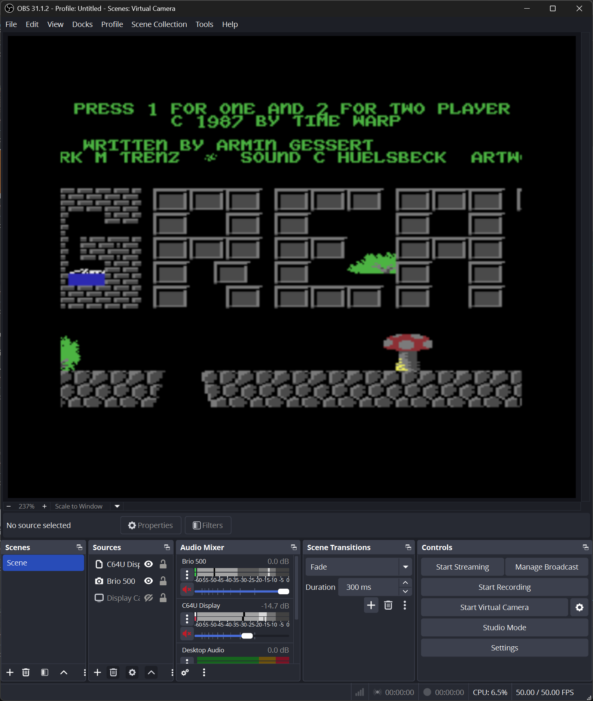
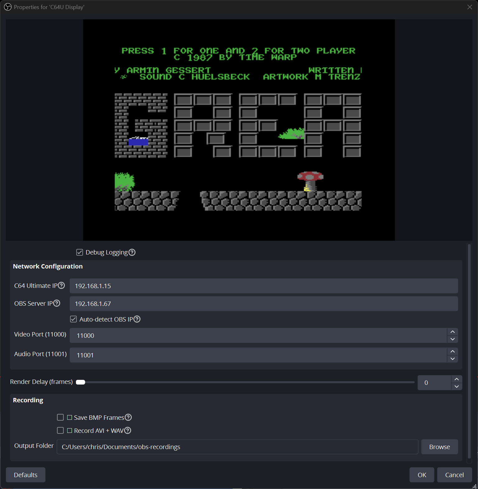

# C64 Ultimate OBS Plugin

Bridge your Commodore 64 Ultimate directly to [OBS Studio](https://obsproject.com/) for seamless streaming and recording over your network connection.


This plugin implements a native OBS source that receives video and audio streams from C64 Ultimate devices (Commodore 64 Ultimate or Ultimate 64) via the Ultimate's built-in data streaming capability.

The plugin connects directly to the Ultimate's network interface, eliminating the need for capture cards or composite video connections.




**Features:**
- Native OBS integration as a standard video source
- Real-time video streaming (PAL 384x272, NTSC 384x240)
- Synchronized audio streaming (16-bit stereo, ~48kHz)
- Network-based connection (UDP/TCP)
- **Enhanced DNS resolution** - reliable hostname resolution on all platforms (Linux/macOS/Windows)
- Automatic VIC-II color space conversion
- Built-in recording capabilities (BMP frames, AVI video, WAV audio)


## Getting Started 🚀

### What You'll Need
- [OBS Studio 32.0.1](https://obsproject.com/download) or above
- [C64 Ultimate](https://www.commodore.net/) or [Ultimate 64](https://ultimate64.com/)
- Network connection between your OBS computer and Ultimate device

### Easy Installation 📦

Grab the right package for your system from the [Releases page](../../releases):

**Windows:**
1. Close OBS Studio
2. Extract `c64u-plugin-for-obs-*-windows-x64.zip` to `C:\ProgramData\obs-studio\plugins`
3. Restart OBS Studio

If you are using Windows Firewall and block all incoming connections, you may have to setup an exclusion to allow for incoming UDP connections
to port 11000 (Video) and 11001 (Audio) from the C64 Ultimate.

You can do this with the following Powershell script. Be sure to adjust the `RemoteAddress` to the IP of your C64 Ultimate:

```powershell
New-NetFirewallRule -DisplayName "C64U" -Direction Inbound -Protocol UDP -LocalPort 11000,11001 -RemoteAddress 192.168.1.64 -Action Allow
```

**macOS:**
1. Close OBS Studio
2. Install `c64u-plugin-for-obs-*-macos-universal.pkg` to `~/Library/Application Support/obs-studio/plugins`
3. Restart OBS Studio

**Linux (Ubuntu/Debian):**
1. Close OBS Studio
2. Install `c64u-plugin-for-obs-*-x86_64-linux-gnu.deb` to `~/.config/obs-studio/plugins` by running:
```bash
sudo dpkg -i c64u-obs-plugin-linux.deb
```

**Further Details:**
See the [OBS Plugins Guide](https://obsproject.com/kb/plugins-guide).


### Configuration ⚙️



**Getting Your C64 on Stream:**

1. **Add Source:** In OBS, create a new source and select "C64U" from the available types
2. **Open Properties:** Select the "C64U" source in your sources list, then click the "Properties" button to open the configuration dialog
3. **Debug Logging:** Enable detailed logging for debugging connection issues (optional)
4. **Configure Network Settings:**
   - **DNS Server IP:** IP address of DNS server for resolving device hostnames (default: `192.168.1.1` for most home routers). Used when the C64U Host is a hostname rather than an IP address. This enhanced DNS resolution bypasses system DNS issues on Linux/macOS where local device names may not resolve properly.
   - **C64U Host:** Enter your Ultimate device's hostname (default: `c64u`) or IP address to enable automatic streaming control from OBS (recommended for convenience), or set to `0.0.0.0` to accept streams from any C64 Ultimate on your network (requires manual control from the device)
   - **OBS Server IP:** IP address where C64 Ultimate sends streams (auto-detected by default)
   - **Auto-detect OBS IP:** Automatically detect and use OBS server IP in streaming commands (recommended)
5. **Configure Ports:** Use the default ports (video: 11000, audio: 11001) unless network conflicts require different values
6. **Render Delay:** Adjust frame buffering (0-100 frames, default 3) to smooth UDP packet loss/reordering
7. **Recording Options (Optional):**
   - **Save BMP Frames:** Enable to save individual frames as BMP files (useful for debugging, impacts performance)
   - **Record AVI + WAV:** Enable to record uncompressed video and audio files (high disk usage)
   - **Output Folder:** Choose where recording files are saved. Default locations by OS:
     - **Windows:** `%USERPROFILE%\Documents\obs-studio\c64u\recordings`
     - **macOS:** `~/Documents/obs-studio/c64u/recordings`
     - **Linux:** `~/Documents/obs-studio/c64u/recordings`
8. **Apply Settings:** Click "OK" to save your configuration

Once configured, live video and audio streams from the C64 Ultimate will be available in OBS Studio.

### Ultimate Device Setup 🎛️

**Automatic Configuration (Recommended):** The OBS plugin automatically controls streaming on the Ultimate device. When you configure the Ultimate's hostname or IP address in the OBS plugin settings, the plugin tells the Ultimate device where to send streams and sends start commands automatically. Thus, no manual streaming adjustments are needed on the Ultimate device.

**Manual Configuration:**
1. Press F2 to access the Ultimate's configuration menu
2. Navigate to "Data Streams" section
3. Set "Stream VIC to" field: `your-obs-ip:11000` (e.g., `192.168.1.100:11000`)
4. Set "Stream Audio to" field: `your-obs-ip:11001` (e.g., `192.168.1.100:11001`)
5. Save configuration changes
6. Manually start streaming from the Ultimate device

For comprehensive configuration details, refer to the [official C64 Ultimate documentation](https://1541u-documentation.readthedocs.io/en/latest/data_streams.html).

### Hostname vs IP Address 🌐

The plugin supports both **hostnames** and **IP addresses** for the C64U Host field with enhanced DNS resolution that works reliably across all platforms:

**Using Hostnames (Recommended):**
- **Default:** `c64u` - The plugin will try to resolve this hostname to an IP address
- **Custom:** `my-c64u` or `retro-pc` - Use any hostname your C64 Ultimate device is known by
- **FQDN Support:** The plugin automatically tries both `hostname` and `hostname.` (with trailing dot) for proper DNS resolution

**Using IP Addresses:**
- **Direct IP:** `192.168.1.64` - Standard IPv4 address format
- **Fallback:** `0.0.0.0` - Accept streams from any C64 Ultimate (no automatic control)

**Enhanced DNS Resolution (New in v2.0):**

The plugin now features advanced hostname resolution that works reliably on Linux and macOS where system DNS may fail for local device names:

1. **System DNS First:** Tries standard system DNS resolution (works for internet hostnames and properly configured networks)
2. **FQDN Resolution:** Attempts resolution with trailing dot (e.g., `c64u.` for some network configurations)
3. **Direct DNS Queries:** On Linux/macOS, bypasses systemd-resolved by querying DNS servers directly:
   - Uses configured **DNS Server IP** (default: `192.168.1.1`)
   - Falls back to common router IPs: `192.168.0.1`, `10.0.0.1`, `172.16.0.1`
4. **Cross-Platform:** Windows uses system DNS (which works reliably), Linux/macOS use enhanced resolution

**DNS Server Configuration:**
- **Default:** `192.168.1.1` (most common home router DNS server)
- **Custom:** Set to your router's IP or a specific DNS server (e.g., `192.168.0.1`, `10.0.0.1`)
- **Automatic Fallback:** If the configured DNS server fails, tries other common router IPs
- **Why This Helps:** Solves Linux/macOS issues where `c64u` hostname doesn't resolve through system DNS but works via direct router queries

**Examples:**
- `c64u` → resolves to `192.168.1.64` via enhanced DNS resolution
- `192.168.1.64` → used directly as IP address
- `retro-basement.local` → resolves via mDNS/Bonjour or direct DNS
- `ultimate64` → tries system DNS first, then direct router DNS queries

**Platform-Specific Behavior:**
- **Windows:** Uses system DNS (typically works without issues)
- **Linux/macOS:** Uses enhanced DNS resolution to bypass systemd-resolved limitations
- **All Platforms:** Support both hostname and IP address formats seamlessly

## Recording Features 📹

The plugin includes built-in recording capabilities that work independently of OBS Studio's recording system, letting you save raw C64 Ultimate data streams directly to disk.

### Recording Options

**Frame Saving (BMP):**
- Saves individual video frames as uncompressed BMP files
- Useful for debugging video issues or creating frame-by-frame analysis
- **Performance Impact:** Enabling this feature will reduce streaming performance due to disk I/O
- Files saved as: `session_YYYYMMDD_HHMMSS/frames/frame_NNNNNN.bmp`

**Video Recording (AVI + WAV):**
- Records uncompressed AVI video and separate WAV audio files
- Captures the raw data stream without OBS processing
- **High Disk Usage:** Uncompressed video files are very large (~50MB per minute)
- Video file: `session_YYYYMMDD_HHMMSS/video.avi` (24-bit BGR format)
- Audio file: `session_YYYYMMDD_HHMMSS/audio.wav` (16-bit stereo PCM)

### File Organization

All recording files are organized into session folders with timestamps:
```
~/Documents/obs-studio/c64u/recordings/
├── session_20240929_143052/
│   ├── frames/           # BMP frame files (if enabled)
│   ├── video.avi         # Uncompressed video (if enabled)
│   └── audio.wav         # Uncompressed audio (if enabled)
└── session_20240929_151234/
    └── ...
```

### Recording Configuration

- **Output Folder Defaults:**
  - **Windows:** `%USERPROFILE%\Documents\obs-studio\c64u\recordings`
  - **macOS:** `~/Documents/obs-studio/c64u/recordings`
  - **Linux:** `~/Documents/obs-studio/c64u/recordings`
- **Automatic Session Management:** New session folder created each time recording is enabled
- **Cross-Platform Compatibility:** Works on Windows, macOS, and Linux

### Usage Notes

- Recording operates independently of OBS Studio's built-in recording
- Both recording options can be enabled simultaneously
- **Recording starts immediately when a checkbox is checked and continues until unchecked**
- **⚠️ Checkbox states persist across OBS restarts - uncheck to stop recording or risk filling disk space**
- Files are written in real-time as data is received from the C64 Ultimate
- Session folders are created automatically with proper directory structure


## Technical Details 🔧

This plugin implements the [C64 Ultimate Data Streams specification](https://1541u-documentation.readthedocs.io/en/latest/data_streams.html#data_streams) to receive video and audio streams from Ultimate devices via UDP/TCP network protocols.

**Supported Platforms:**
- Windows 10/11 (x64) - verified on Windows 11
- Linux with X window system or Wayland - verified on Kubuntu 24.04
- macOS 11+ (Intel/Apple Silicon) - yet to be verified

**Software Requirements:**
- [OBS Studio 32.0.1](https://obsproject.com/download) or above

**Hardware Requirements:**

One of:
- [Ultimate 64 Elite](https://ultimate64.com/Ultimate-64-Elite) - verified
- [Ultimate 64 Elite MK2](https://ultimate64.com/Ultimate-64-Elite-MK2) - yet to be verified
- [C64 Ultimate](https://www.commodore.net/) - yet to be verified since not released yet

**Video Formats:**
- PAL: 384x272 @ 50Hz
- NTSC: 384x240 @ 60Hz
- Color space: VIC-II palette with automatic RGB conversion

**Audio Format:**
- 16-bit stereo PCM
- Sample rate: ~48kHz (device dependent)
- Low-latency streaming

**Network Requirements:**
- UDP/TCP connectivity to Ultimate device
- Bandwidth: ~22 Mbps total (21.7 Mbps video + 1.4 Mbps audio, uncompressed streams)
- Built-in UDP jitter compensation via configurable frame buffering

**DNS Resolution:**
- **Cross-platform hostname support:** Works reliably on Windows, Linux, and macOS
- **Enhanced Linux/macOS resolution:** Bypasses systemd-resolved limitations using direct DNS queries
- **Configurable DNS server:** Set custom DNS server IP for hostname resolution (default: 192.168.1.1)
- **Automatic fallbacks:** Falls back to common router IPs (192.168.0.1, 10.0.0.1, etc.) if configured DNS fails
- **FQDN support:** Tries both standard hostname and FQDN (with trailing dot) resolution

**Recording Formats:**
- BMP frames: 24-bit uncompressed bitmap images
- AVI video: Uncompressed BGR24 format with precise timing
- WAV audio: 16-bit stereo PCM, sample rate matches C64 Ultimate output
- Session organization: Automatic timestamped folder creation


## Troubleshooting 🔍

**No video stream? 📺**
- Verify that both IP addresses are correct
- Check Ultimate device has data streaming enabled
- Confirm firewall allows UDP traffic on configured ports

**Audio sync issues? 🔊**
- Check audio port configuration (default 11001)
- Verify OBS audio monitoring settings

**Plugin missing from OBS? 🤔**
- Confirm OBS Studio version 32.0.1+
- Verify plugin installed to correct directory
- Check OBS logs for plugin loading errors
- Restart OBS completely after installation

**Connection acting up? 📡**
- Network latency should be <100ms for optimal performance
- Check for network congestion or WiFi interference
- Consider wired Ethernet connection for stability

**Recording troubles? 💾**
- **Files not created:** Verify output folder path exists and is writable
- **Performance drops with BMP saving:** Frame saving impacts performance significantly; disable if not needed
- **Large disk usage:** AVI recording creates uncompressed files (~50MB/minute); monitor disk space
- **Recording stops unexpectedly:** Check disk space and folder permissions


## For Developers 🔧

See the [Developer Documentation](doc/developer.md) for build instructions, testing procedures, and contribution guidelines.


## License

This project is licensed under the GPL v2 License - see the [LICENSE](LICENSE) file for details.
