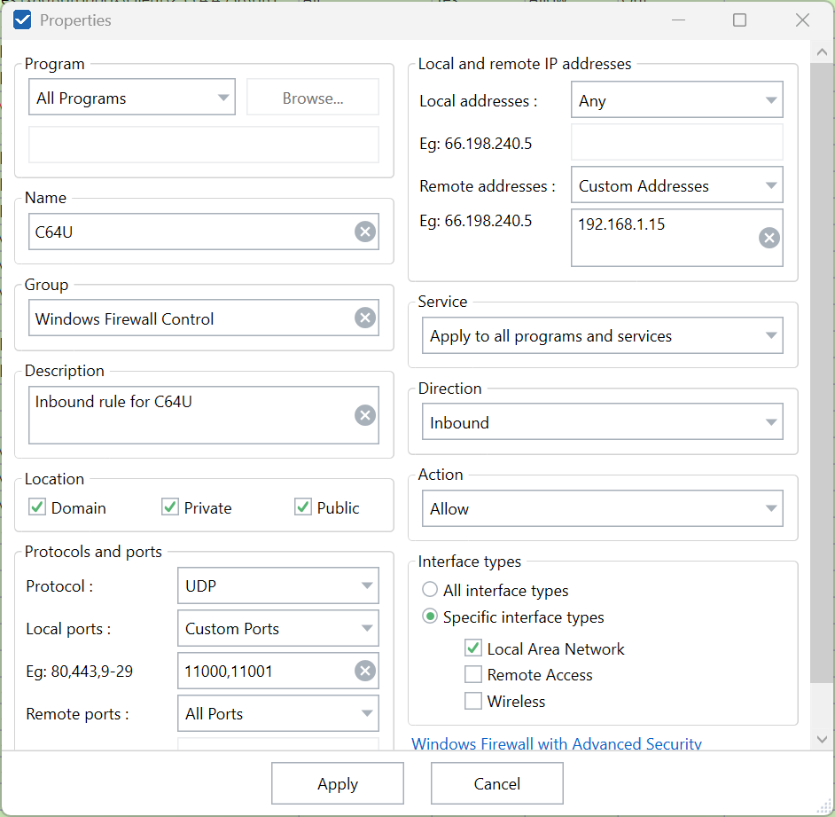

# C64 Ultimate OBS Plugin 🎮

Bridge your Commodore 64 Ultimate device directly to [OBS Studio](https://obsproject.com/) for seamless streaming and recording over your network connection.

This plugin implements a native OBS source that receives video and audio streams from C64 Ultimate devices (Commodore 64 Ultimate, Ultimate 64, Ultimate II+, etc.) via the Ultimate's built-in data streaming capability.

The plugin connects directly to the Ultimate's network interface, eliminating the need for capture cards or composite video connections.


**Features:**
- Native OBS integration as a standard video source
- Real-time video streaming (PAL 384x272, NTSC 384x240)
- Synchronized audio streaming (16-bit stereo, ~48kHz)
- Network-based connection (UDP/TCP)
- Automatic VIC-II color space conversion
- Built-in recording capabilities (BMP frames, AVI video, WAV audio)
- Zero additional hardware requirements

**System Requirements:**
- [OBS Studio 32.0.1](https://obsproject.com/download) or above. May work with older versions, but not tested.
- See [OBS System Requirements](https://obsproject.com/kb/) for more details

**Supported platforms:**
  - Windows 10/11 (x64)
  - macOS 10.15+ (Intel/Apple Silicon)
  - Linux (Ubuntu 20.04+, other distributions via manual build)


---

## Getting Started 🚀

### What You'll Need
- **OBS Studio** 32.0.1 or later
- **[C64 Ultimate](https://www.commodore.net/)** or [Ultimate 64](https://ultimate64.com/) with network streaming support
- **Network connection** between your OBS computer and Ultimate device

### Easy Installation 📦

Grab the right package for your system from the [Releases page](../../releases):

**Windows:**
1. Close OBS Studio
2. Extract `c64u-plugin-for-obs-*-windows-x64.zip` to `C:\ProgramData\obs-studio\plugins`
3. Restart OBS Studio

If you are using Windows Firewall and block all incoming connections, you may have to setup an exclusion to allow for incoming UDP connections
to port 11000 (Video) and 11001 (Audio):



You can set this up with the following Powershell script. Be sure to adjust the `RemoteAddress` to the IP of your C64 Ultimate:

```powershell
New-NetFirewallRule -DisplayName "C64U" -Direction Inbound -Protocol UDP -LocalPort 11000,11001 -RemoteAddress 192.168.1.15 -Action Allow
```

**macOS:**
1. Close OBS Studio
2. Install `c64u-plugin-for-obs-*-macos-universal.pkg` to `~/Library/Application Support/obs-studio/plugins`
3. Restart OBS Studio

**Linux (Ubuntu/Debian):**
1. Close OBS Studio
2. Install `c64u-plugin-for-obs-*-x86_64-linux-gnu.deb` to `~/.config/obs-studio/plugins` by running:
```bash
sudo dpkg -i c64u-obs-plugin-linux.deb
```

**Further Details:**
See the [OBS Plugins Guide](https://obsproject.com/kb/plugins-guide).

---

### Configuration ⚙️


**Getting Your C64 on Stream:**

1. **Add Source:** In OBS, create a new source and select "C64 Ultimate Stream" from the available types
2. **Open Properties:** Select the "C64 Ultimate Stream" source in your sources list, then click the "Properties" button to open the configuration dialog
3. **Debug Logging:** Enable detailed logging for debugging connection issues (optional)
4. **Configure Network Settings:**
   - **C64 Ultimate IP:** Enter your Ultimate device's IP address to enable automatic streaming control from OBS (recommended for convenience), or set to `0.0.0.0` to accept streams from any C64 Ultimate on your network (requires manual control from the device)
   - **OBS Server IP:** IP address where C64 Ultimate sends streams (auto-detected by default)
   - **Auto-detect OBS IP:** Automatically detect and use OBS server IP in streaming commands (recommended)
5. **Configure Ports:** Use the default ports (video: 11000, audio: 11001) unless network conflicts require different values
6. **Render Delay:** Adjust frame buffering (0-100 frames, default 10) to smooth UDP packet loss/reordering
7. **Recording Options (Optional):**
   - **Save BMP Frames:** Enable to save individual frames as BMP files (useful for debugging, impacts performance)
   - **Record AVI + WAV:** Enable to record uncompressed video and audio files (high disk usage)
   - **Output Folder:** Choose where recording files are saved (defaults to `~/Documents/obs-studio/c64u/recordings`)
8. **Apply Settings:** Click "OK" to save your configuration

Once configured, live video and audio streams from the C64 Ultimate will be available in OBS Studio.

### Ultimate Device Setup 🎛️

**Important:** Your C64 Ultimate device needs to know where to send its streams—let's set that up!

**Accessing the Configuration Menu:**
Access the Ultimate's configuration menu (typically by pressing F2) and navigate to:
```
F2 → Data Streams
```

**Required Stream Settings:**
Configure these destination addresses to point to your OBS server:
- **Stream VIC to:** `192.168.1.185:11000` (replace with your OBS server's IP and video port)
- **Stream Audio to:** `192.168.1.185:11001` (replace with your OBS server's IP and audio port)

**Address Format Examples:**
- IP address format: `192.168.1.185:11000`
- Hostname format: `obs-server:11000`

**Step-by-Step Configuration:**
1. Press F2 to access the Ultimate's configuration menu
2. Navigate to the "Data Streams" section
3. Set the "Stream VIC to" field using your OBS server's IP address and port (e.g., `192.168.1.185:11000`)
4. Set the "Stream Audio to" field using your OBS server's IP address and audio port (e.g., `192.168.1.185:11001`)
5. Save your configuration changes
6. Enable streaming when you're ready to begin capturing

For comprehensive configuration details, refer to the [official C64 Ultimate documentation](https://1541u-documentation.readthedocs.io/en/latest/data_streams.html).

**Automatic Control:** When a specific IP address is configured in the OBS plugin settings, the plugin can automatically send start/stop commands to the Ultimate device.

---

## Recording Features 📹

Capture those perfect gaming moments! The plugin includes built-in recording capabilities that work independently of OBS Studio's recording system, letting you save raw C64 Ultimate data streams directly to disk.

### Recording Options

**Frame Saving (BMP):**
- Saves individual video frames as uncompressed BMP files
- Useful for debugging video issues or creating frame-by-frame analysis
- **Performance Impact:** Enabling this feature will reduce streaming performance due to disk I/O
- Files saved as: `session_YYYYMMDD_HHMMSS/frames/frame_NNNNNN.bmp`

**Video Recording (AVI + WAV):**
- Records uncompressed AVI video and separate WAV audio files
- Captures the raw data stream without OBS processing
- **High Disk Usage:** Uncompressed video files are very large (~50MB per minute)
- Video file: `session_YYYYMMDD_HHMMSS/video.avi` (24-bit BGR format)
- Audio file: `session_YYYYMMDD_HHMMSS/audio.wav` (16-bit stereo PCM)

### File Organization

All recording files are organized into session folders with timestamps:
```
~/Documents/obs-studio/c64u/recordings/
├── session_20240929_143052/
│   ├── frames/           # BMP frame files (if enabled)
│   ├── video.avi         # Uncompressed video (if enabled)
│   └── audio.wav         # Uncompressed audio (if enabled)
└── session_20240929_151234/
    └── ...
```

### Recording Configuration

- **Output Folder:** Configurable base directory for all recordings
  - Windows default: `%USERPROFILE%\Documents\obs-studio\c64u\recordings`
  - macOS/Linux default: `~/Documents/obs-studio/c64u/recordings`
- **Automatic Session Management:** New session folder created each time recording is enabled
- **Cross-Platform Compatibility:** Works on Windows, macOS, and Linux

### Usage Notes

- Recording operates independently of OBS Studio's built-in recording
- Both recording options can be enabled simultaneously
- Recording starts/stops automatically when the respective checkboxes are toggled
- Files are written in real-time as data is received from the C64 Ultimate
- Session folders are created automatically with proper directory structure

---

## Technical Details 🔧

This plugin implements the [C64 Ultimate Data Streams specification](https://1541u-documentation.readthedocs.io/en/latest/data_streams.html#data_streams) to receive video and audio streams from Ultimate devices via UDP/TCP network protocols.

**Supported Platforms:**
- Windows 10/11 (x64)
- macOS 10.15+ (Intel/Apple Silicon)
- Linux (Ubuntu 20.04+, other distributions via manual build)

**Video Formats:**
- PAL: 384x272 @ 50Hz
- NTSC: 384x240 @ 60Hz
- Color space: VIC-II palette with automatic RGB conversion

**Audio Format:**
- 16-bit stereo PCM
- Sample rate: ~48kHz (device dependent)
- Low-latency streaming

**Network Requirements:**
- UDP/TCP connectivity to Ultimate device
- Bandwidth: ~2-5 Mbps (uncompressed video stream)
- Latency: <100ms on local network

**Recording Formats:**
- BMP frames: 24-bit uncompressed bitmap images
- AVI video: Uncompressed BGR24 format with precise timing
- WAV audio: 16-bit stereo PCM, sample rate matches C64 Ultimate output
- Session organization: Automatic timestamped folder creation

---

## Troubleshooting 🔍

**No video stream? 📺**
- If using specific IP: Verify Ultimate device IP address is correct
- If using default (0.0.0.0): Ensure C64 Ultimate is streaming and both devices are on same network
- Ensure both devices are on the same network segment
- Check Ultimate device has data streaming enabled
- Confirm firewall allows UDP traffic on configured ports

**Audio sync issues? 🔊**
- Ultimate device audio streaming must be enabled separately
- Check audio port configuration (default 11001)
- Verify OBS audio monitoring settings

**Plugin missing from OBS? 🤔**
- Confirm OBS Studio version 32.0.1+
- Verify plugin installed to correct directory
- Check OBS logs for plugin loading errors
- Restart OBS completely after installation

**Connection acting up? 📡**
- Network latency should be <100ms for optimal performance
- Check for network congestion or WiFi interference
- Consider wired Ethernet connection for stability

**Recording troubles? 💾**
- **Files not created:** Verify output folder path exists and is writable
- **Performance drops with BMP saving:** Frame saving impacts performance significantly; disable if not needed
- **Large disk usage:** AVI recording creates uncompressed files (~50MB/minute); monitor disk space
- **Recording stops unexpectedly:** Check disk space and folder permissions

---

## For Developers 🔧

See the [Developer Documentation](doc/developer.md) for build instructions, testing procedures, and contribution guidelines.

---

## License

This project is licensed under the MIT License - see the [LICENSE](LICENSE) file for details.
